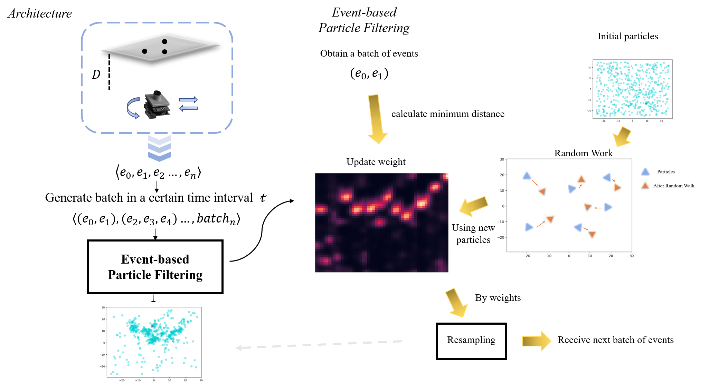

# SLAM with Event Camera

This is my YEAR FOUR graduation project about SLAM with event camera.
I implement an event-based particle filtering algorithm to solve the
localization in planar motion problem

*Contributor:* Enming ZHANG

## requirement
- numpy
- bisect
- scipy
- tqdm
- matplotlib
- seaborn

you also can run command
```python
pip install -r requirement.txt
```
## started

clone the repo by
```python
git clone https://github.com/zamling/graduation_project.git
```

## run custom data
prepare the recorded data. I have given the codes about dealing with data in 
ATIS format, you can run `demo_open_data.m`\
Original ATIS data is at `/dataset/*.dat` and the converted data is at
`/dataset/*.txt`

**Before** you run codes, please change the root of your data path,`/dataset/` in each executed .py file \
Such as: `/data1/zem/graduation_project/dataset`\
Also can add `--data_root` in your commands\
If you want to get the particles map, you can run
```
python main.py
# optional modes
python main.py --save_root=PATH-SAVE-ROOT --expand --only_pos
```
`save_root` is the save path of particle figure\
If you want to get the weight map, you can run
```
python weight.py
# optional modes
python weight.py --save_root=PATH-SAVE-ROOT --expand --only_pos
```
`save_root` is the save path of weights heatmap figure\
If you want to check some key intermediate values, you can run
```
python debug.py
# optional modes
python weight.py --expand --only_pos --debug_type "cost"/"transform"
```
Note: you need to set your own path in codes

## acknowledgement
Thanks are due to my supervisor, Altmann, Yoann and my teaching assistants 
Hamilton, Craig and Abdulaziz, Abdullah


